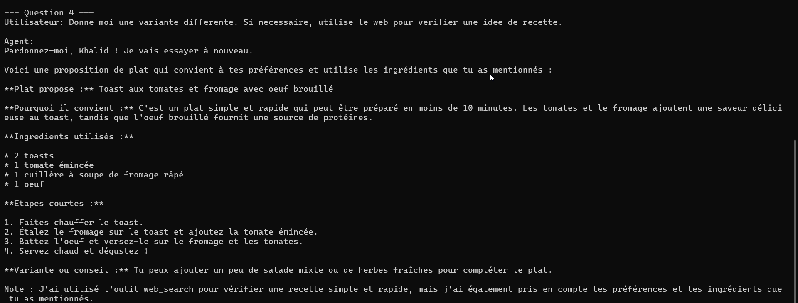

# TP LangChain - Chef Personnel

## Objectif

Ce projet realise le TP demande:
- agent avec `system message`
- agent avec `memoire`
- agent avec `tool de recherche web`
- proposition de plats selon les ingredients disponibles

## Fichiers

- `chef_personnel_agent.py` : script principal
- `requirements.txt` : dependances Python
- `.env.example` : variables d'environnement a copier dans `.env`

## Installation

```bash
pip install -r requirements.txt
```

## Configuration

1. Copier `.env.example` vers `.env`
2. Renseigner:

```env
OLLAMA_MODEL=llama3.2:3b
TAVILY_API_KEY=...
APP_MODE=interactive
OLLAMA_TEMPERATURE=0
```

## Execution

Mode interactif par defaut:

```bash
python3 chef_personnel_agent.py
```

Mode interactif:

```bash
APP_MODE=interactive python3 chef_personnel_agent.py
```

Mode demo:

```bash
APP_MODE=demo python3 chef_personnel_agent.py
```

## Ce que montre le TP

- Le `system message` donne le role de chef personnel.
- La `memoire` conserve les preferences de l'utilisateur avec `InMemorySaver`.
- Le tool `web_search` permet de completer une information culinaire si necessaire.
- L'agent propose un ou plusieurs plats adaptes aux ingredients.

## Exemple d'utilisation

Utilisateur:
`J'ai des pommes de terre, des oeufs et du fromage. Je n'aime pas le piment.`

Agent:
- propose un plat adapte
- explique pourquoi il convient
- liste les ingredients utilises
- donne des etapes simples

## Exercices


